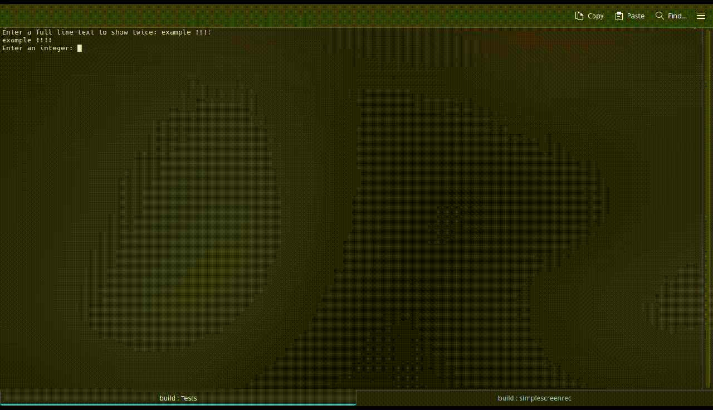

# CppSafeIO

> [!NOTE]
> TL;DR: Portable and easy-to-use ```C++``` library which provides clean input/output operations.

```C++```'s native input/output library (```iostream```) doesn't provide the kind of high-level functions that you might like to use in your own projects, such as clearing the console, or stopping the natural control flow until a given key is pressed. This library aims to solve that in an beginner-friendly approach!  

### Tests running


## How to implement in your own projects, using ```CMake```

> [!TIP]
> The simplest way to implement this library in your projects would be by fetching the library as a subfolder of a given project's build system, and ultimately, make use of ```include_directory()``` to execute this folder's ```CMakeLists.txt```, which makes it possible to use ```target_link_libraries()``` with your executable and the CppSafeIO library, as follows:

Your project's directory structure:
```
./project
    CMakeLists.txt
    /src
    /CppSafeIO
```

Your project's main ```CMakeLists.txt```:
```
...

add_subdirectory(CppSafeIO)
target_link_libraries(YourExecutable CppSafeIO)

...
```

> [!NOTE]
> This approach is used by this project's ```tests``` directory.

Nonetheless, I highly recommend making use of a second, cleaner approach where you don't have to directly include the library as one of your project's subdirectories:

> [!IMPORTANT]
> For this approach, your ```CMake``` build system should use at least ```CMake v3.14.```.

You can just fetch it using ```FetchContent```, and then link the library as follows:

Your project's main ```CMakeLists.txt```:
```
...

include(FetchContent)

FetchContent_Declare( cpp-safe-io 
    GIT_REPOSITORY  https://github.com/DanielRamirez404/CppSafeIO.git 
    GIT_TAG         v1.1.0
    GIT_SHALLOW     TRUE 
) 

FetchContent_MakeAvailable(cpp-safe-io)

target_link_libraries(YourExecutable CppSafeIO)

...
```

## How to use

You only need to include the ```cpp-safe-io.h``` header file. Henceforth, all of the library's functions will be available inside of the ```CppSafeIO``` namespace, similarly to the ```std``` namespace of ```C++```'s standard library. Here's a simple example showcasing a program that won't exit until the enter key is pressed. 

> [!TIP]
> You can also add the ```using namespace CppSafeIO;``` statement if you wish to use this library's functions without needing to write the namespace, although that's usually considered a bad practice.

main.cpp:
```
#include "cpp-safe-io.h"
#include <iostream>

int main()
{
    std::cout << "press the enter key to finish\n";
    CppSafeIO::pressEnterToContinue();
    return 0;
}
```

## Supported Functions

> [!WARNING]
> Don't forget to add the ```CppSafeIO``` namespace if you want to try out any of these functions.

* ```<typename T> T getInput()```: gets the input from the user as the provided datatype as the template argument (```<T>```). On failure, it throws a ```std::runtime_error```.
* ```void clearConsole()```: clears the console where the program is executed if the OS is supported (namely, ```Windows```, ```Linux``` or ```MacOS``` systems).
* ```void pressEnterToContinue()```: waits until the user presses the ```Enter``` key and ignores all input previously entered.
* ```void ignoreExceedingInput()```: clears ```std::cin```'s buffer.
* ```void parseYesNoInput()```: gets one character input and returns true or false if it matches the ```Y``` or ```N``` characters, respectively (case insensitive). On failure, it throws a ```std::runtime_error```.
* ```std::string getInputLine():``` gets all entered input until a line break, as a ```std::string```.

## Testing

> [!TIP]
> You can test this library's functions in the ```tests``` subdirectory.
